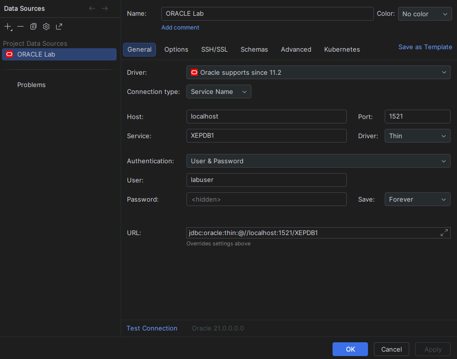
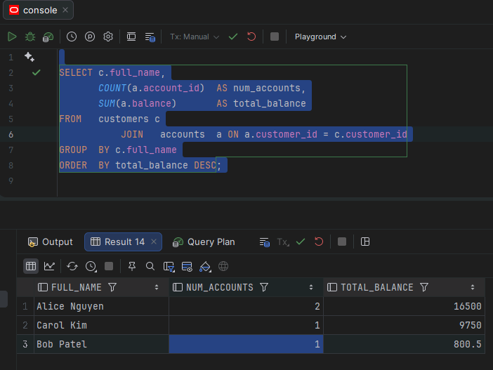

# Lab 3.0 - Oracle Environment Orientation

**MD282 | Week 3 - Oracle Data, PL/SQL and Performance Engineering**  
**Module 6 | Estimated time: 60-75 minutes | Tools: SQL\*Plus, IntelliJ IDEA Ultimate**

---

## Overview

Before you can tune queries, write PL/SQL, or wire Oracle into a Spring Data repository, you need to feel at home in the Oracle environment. This lab takes you from a blank command prompt to a working schema with data, using both the command-line SQL\*Plus tool and the database console built into IntelliJ IDEA Ultimate.

By the end of this lab you will have:

- Launched SQL\*Plus and verified your Oracle 21c instance is running
- Created a dedicated lab schema (user) and connected to it
- Built a small relational schema from DDL statements
- Loaded sample data and run basic queries
- Connected IntelliJ's Database tool to the same schema and run queries from the IDE
- Explored several Oracle-specific features that differ from SQL Server

---

## Background - Oracle for C# / SQL Server Developers

Oracle 21c and SQL Server share the same relational foundations, but the terminology and tooling differ in important ways. The table below maps the concepts you already know to their Oracle equivalents.

| SQL Server Concept | Oracle Equivalent | Key Difference |
|--------------------|-------------------|----------------|
| `SSMS / sqlcmd` | `SQL*Plus / SQLcl` | SQL\*Plus is the classic CLI; SQLcl is a modern alternative. IntelliJ replaces SSMS for GUI work. |
| Database | Pluggable Database (PDB) | Oracle 21c XE has one CDB and one PDB named `XEPDB1` by default. |
| Schema / Owner | User (Schema) | In Oracle, a user **is** a schema. Creating a user creates its namespace. |
| `IDENTITY` column | `GENERATED AS IDENTITY` | Same concept, different syntax (added in Oracle 12c). |
| `nvarchar / varchar` | `VARCHAR2` | Oracle `VARCHAR2` is the standard string type; avoid `CHAR` for variable-length data. |
| `getdate()` | `SYSDATE / SYSTIMESTAMP` | `SYSDATE` returns date+time; use `SYSTIMESTAMP` for millisecond precision. |
| `GO` (batch separator) | `/` (forward slash) | A lone `/` on its own line executes the current buffer in SQL\*Plus. |
| `BEGIN...END` (T-SQL) | `BEGIN...END` (PL/SQL) | Syntax is similar but PL/SQL has `DECLARE` sections and uses `:=` for assignment. |

---

## Understanding the Oracle 21c Architecture

Before connecting to Oracle for the first time, it helps to understand what you are actually connecting to. Oracle 21c uses a two-layer architecture that is quite different from SQL Server, and knowing this upfront will prevent a lot of confusion as you work through the labs.

### The Container Database (CDB)

When Oracle 21c is installed, it creates a single **Container Database** or CDB. Think of this as the Oracle engine itself - it manages memory, background processes, disk I/O, and all the core database infrastructure. There is only one CDB per Oracle installation and it runs everything underneath.

You connect to the CDB root when you log in as SYS. From there you can see the overall state of the database engine, start and stop the instance, and manage the pluggable databases that live inside it. However, the CDB root is not where application data lives - it is an administrative layer, not a workspace.

### The Pluggable Database (PDB)

Inside the CDB sits one or more **Pluggable Databases** or PDBs. Each PDB behaves like a completely self-contained database from the perspective of anyone connecting to it. It has its own users, schemas, tables, tablespaces, and data files. Users connected to one PDB have no visibility into any other PDB.

Your Oracle 21c XE installation ships with one PDB named **XEPDB1**. This is where all your lab work happens. Every table you create, every user you define, and every query you run will live inside XEPDB1.

A useful way to think about the relationship:

| Layer | What it is | SQL Server equivalent |
|-------|------------|-----------------------|
| CDB | The Oracle engine and infrastructure | The SQL Server instance |
| PDB (XEPDB1) | Your working database | A database within that instance |
| labuser | Your schema inside the PDB | A schema owner within the database |

### PDB$SEED

You will also see a second entry called **PDB$SEED** when you query the list of pluggable databases. This is a locked, read-only template that Oracle uses internally when creating new PDBs. You will never connect to it or use it directly - you can ignore it.

### Why This Matters for Your Connections

This architecture explains something that catches most SQL Server developers off guard when they first use Oracle. If you connect without specifying a service name, like this:

```sql
sqlplus labuser/labpass123
```

Oracle will try to authenticate you against the CDB root, which has never heard of `labuser`. The user does not exist there - it only exists inside XEPDB1. You will get an ORA-01017 invalid credentials error even though the username and password are correct.

You must always include the service name in your connection string to land in the right PDB:

```sql
sqlplus labuser/labpass123@localhost/XEPDB1
```

The same rule applies to your JDBC connection string in IntelliJ and later in your Spring Boot configuration. The `/XEPDB1` at the end is not optional - it is what routes your connection to the correct pluggable database.

## Part 1 - Connecting with SQL\*Plus

### Step 1.1 - Open a Command Prompt and Log In

Open a Windows **Command Prompt** (not PowerShell - SQL\*Plus behaves more predictably in CMD).

```sql
sqlplus sys/password as sysdba
```

You should see the `SQL>` prompt. If you see **"Connected to an idle instance"**, start the database first:

```sql
STARTUP
```

> **Note:** `STARTUP` will mount and open the database in one command. Wait until you see `Database opened.` before proceeding.

---

### Step 1.2 - Verify the Instance and Check the PDB

Run the following queries to confirm what you are connected to:

```sql
SELECT instance_name, status, version FROM v$instance;
```

```sql
SELECT name, open_mode FROM v$pdbs;
```

You should see `XEPDB1` listed with `OPEN_MODE = READ WRITE`. If it shows `MOUNTED`, open it:

```sql
ALTER PLUGGABLE DATABASE XEPDB1 OPEN;
```

> **Note:** Oracle 21c XE ships with one Pluggable Database (`XEPDB1`). All lab work will happen inside the PDB, not the root container (`CDB$ROOT`) you are currently connected to.

---

### Step 1.3 - Create a Lab Schema (User)

In Oracle, creating a user is the same as creating a schema namespace. All objects you create as that user live in that schema.

First, switch your session to the PDB:

```sql
ALTER SESSION SET CONTAINER = XEPDB1;
```

Now create the lab user and grant it the permissions it needs:

```sql
CREATE USER labuser IDENTIFIED BY labpass123
DEFAULT TABLESPACE USERS
TEMPORARY TABLESPACE TEMP
QUOTA UNLIMITED ON USERS;
```

```sql
GRANT CREATE SESSION, CREATE TABLE, CREATE SEQUENCE,
      CREATE PROCEDURE, CREATE TRIGGER TO labuser;
```

---

### Step 1.4 - Connect as labuser

```sql
CONNECT labuser/labpass123@localhost/XEPDB1
```

The prompt will remain `SQL>` but you are now operating as `labuser` inside `XEPDB1`. Verify:

```sql
SHOW USER
```

```sql
SELECT sys_context('USERENV','CON_NAME') FROM dual;
```

> **Tip:** `DUAL` is Oracle's built-in single-row dummy table. Use it whenever you need to evaluate an expression without querying a real table - the Oracle equivalent of `SELECT getdate()` in T-SQL.

---

## Part 2 - Creating and Populating a Schema

### Step 2.1 - Create the Tables

You will build a minimal banking schema: customers, accounts, and transactions. This schema will be expanded in later labs.

```sql
CREATE TABLE customers (
  customer_id   NUMBER GENERATED AS IDENTITY PRIMARY KEY,
  full_name     VARCHAR2(100)  NOT NULL,
  email         VARCHAR2(150)  UNIQUE NOT NULL,
  created_date  DATE           DEFAULT SYSDATE NOT NULL
);
```

```sql
CREATE TABLE accounts (
  account_id    NUMBER GENERATED AS IDENTITY PRIMARY KEY,
  customer_id   NUMBER         NOT NULL,
  account_type  VARCHAR2(20)   CHECK (account_type IN ('CHECKING','SAVINGS')),
  balance       NUMBER(15,2)   DEFAULT 0 NOT NULL,
  opened_date   DATE           DEFAULT SYSDATE NOT NULL,
  CONSTRAINT fk_acct_cust FOREIGN KEY (customer_id)
    REFERENCES customers(customer_id)
);
```

```sql
CREATE TABLE transactions (
  txn_id        NUMBER GENERATED AS IDENTITY PRIMARY KEY,
  account_id    NUMBER         NOT NULL,
  txn_type      VARCHAR2(10)   CHECK (txn_type IN ('CREDIT','DEBIT')),
  amount        NUMBER(15,2)   NOT NULL,
  txn_date      TIMESTAMP      DEFAULT SYSTIMESTAMP NOT NULL,
  description   VARCHAR2(255),
  CONSTRAINT fk_txn_acct FOREIGN KEY (account_id)
    REFERENCES accounts(account_id)
);
```

Confirm the tables exist:

```sql
SELECT table_name FROM user_tables ORDER BY table_name;
```

---

### Step 2.2 - Insert Sample Data

```sql
INSERT INTO customers (full_name, email) VALUES ('Alice Nguyen', 'alice@example.com');
INSERT INTO customers (full_name, email) VALUES ('Bob Patel',   'bob@example.com');
INSERT INTO customers (full_name, email) VALUES ('Carol Kim',   'carol@example.com');
```

```sql
INSERT INTO accounts (customer_id, account_type, balance) VALUES (1, 'CHECKING', 4500.00);
INSERT INTO accounts (customer_id, account_type, balance) VALUES (1, 'SAVINGS',  12000.00);
INSERT INTO accounts (customer_id, account_type, balance) VALUES (2, 'CHECKING', 800.50);
INSERT INTO accounts (customer_id, account_type, balance) VALUES (3, 'SAVINGS',  9750.00);
```

```sql
INSERT INTO transactions (account_id, txn_type, amount, description)
VALUES (1, 'CREDIT', 2000.00, 'Payroll deposit');

INSERT INTO transactions (account_id, txn_type, amount, description)
VALUES (1, 'DEBIT',  450.00,  'Rent payment');

INSERT INTO transactions (account_id, txn_type, amount, description)
VALUES (3, 'DEBIT',  200.00,  'Grocery store');
```

```sql
COMMIT;
```

> **Important:** Oracle does **not** auto-commit DML. Unlike SQL Server's default behaviour, your `INSERT`/`UPDATE`/`DELETE` statements are invisible to other sessions until you `COMMIT`. Always commit or rollback explicitly.

---

### Step 2.3 - Run Basic Queries

Try the following queries and note the results:

```sql
-- 1. List all customers
SELECT * FROM customers;
```

```sql
-- 2. Join customers and accounts
SELECT c.full_name, a.account_type, a.balance
FROM   customers c
JOIN   accounts  a ON a.customer_id = c.customer_id
ORDER  BY c.full_name, a.account_type;
```

```sql
-- 3. Total balance per customer
SELECT c.full_name, SUM(a.balance) AS total_balance
FROM   customers c
JOIN   accounts  a ON a.customer_id = c.customer_id
GROUP  BY c.full_name
ORDER  BY total_balance DESC;
```

```sql
-- 4. Transactions with account owner
SELECT c.full_name, t.txn_type, t.amount, t.description, t.txn_date
FROM   transactions t
JOIN   accounts     a ON a.account_id  = t.account_id
JOIN   customers    c ON c.customer_id = a.customer_id;
```

---

## Part 3 - SQL\*Plus Formatting Commands

SQL\*Plus output can be hard to read by default. These formatting commands make results usable during debugging and demos.

```sql
SET LINESIZE 150
SET PAGESIZE 50
COLUMN full_name    FORMAT A25
COLUMN email        FORMAT A30
COLUMN account_type FORMAT A10
COLUMN balance      FORMAT $999,999.99
```

```sql
SELECT c.full_name, c.email, a.account_type, a.balance
FROM   customers c
JOIN   accounts  a ON a.customer_id = c.customer_id;
```

> **Tip:** You can save these `SET` and `COLUMN` commands to a file called `login.sql` in the same folder as `sqlplus.exe` and they will run automatically every time you start SQL\*Plus.

---

## Part 4 - Connecting from IntelliJ IDEA Ultimate

IntelliJ IDEA Ultimate includes a full-featured database console that replaces SSMS for Oracle work. Once connected, you can browse schemas, run SQL, view execution plans, and export results.

### Step 4.1 - Open the Database Tool Window

- In IntelliJ, go to **View -> Tool Windows -> Database** (or press the Database icon in the right-hand sidebar).
- Click the **+** button -> **Data Source -> Oracle**.

---

### Step 4.2 - Configure the Connection

Fill in the connection dialog as follows:

| Field | Value |
|-------|-------|
| Host | `localhost` |
| Port | `1521` |
| Connection type | **Service Name** (not SID) |
| Service Name | `XEPDB1` |
| User | `labuser` |
| Password | `labpass123` |
| Driver | Oracle (download automatically if prompted) |

Click **Test Connection**. You should see a green checkmark and "Successful". Click **OK**.

> **Note:** Make sure you select **Service Name**, not SID, in the connection type dropdown. `XEPDB1` is a service name - using SID will connect you to the root CDB instead.




---

### Step 4.3 - Explore the Schema Browser

- Expand the connection node in the Database panel.
- Navigate to **labuser -> Tables** and confirm `CUSTOMERS`, `ACCOUNTS`, and `TRANSACTIONS` appear.
- Double-click any table to see its data in a grid view.
- Right-click a table and choose **Modify Table** to inspect the column definitions.


---

### Step 4.4 - Run a Query in the IntelliJ Console

Right-click the `labuser` connection -> **New -> Query Console**.

Type the following query and press `Ctrl+Enter` to execute:

```sql
SELECT c.full_name,
       COUNT(a.account_id)  AS num_accounts,
       SUM(a.balance)       AS total_balance
FROM   customers c
JOIN   accounts  a ON a.customer_id = c.customer_id
GROUP  BY c.full_name
ORDER  BY total_balance DESC;
```

Results appear in the output panel below the editor. You can right-click the grid to export to CSV or copy rows to the clipboard.

> **Tip:** IntelliJ provides Oracle-aware code completion. Start typing `SELECT` and the IDE will suggest column names and table aliases. This is especially useful when writing complex joins.



---

### Step 4.5 - View an Execution Plan from IntelliJ

Highlight the query above, then choose **Explain Plan** from the right-click context menu (or press `Ctrl+Shift+E`). IntelliJ displays the plan in a tree view. You will explore execution plans in depth in Lab 3.2 - for now just notice that a **Full Table Scan** is shown for small tables with no indexes.

---

## Part 5 - Oracle-Specific Observations

Run the following short exercises to observe Oracle behaviours that differ from SQL Server. These can be run in either SQL\*Plus or the IntelliJ console.

### Exercise A - Date Arithmetic

```sql
-- Oracle DATE includes time. Add 7 days to today:
SELECT SYSDATE, SYSDATE + 7 AS next_week FROM dual;
```

```sql
-- Extract just the date part:
SELECT TRUNC(SYSDATE) AS today_only FROM dual;
```

```sql
-- Days between two dates (returns a NUMBER, not an interval):
SELECT SYSDATE - TO_DATE('2024-01-01','YYYY-MM-DD') AS days_since FROM dual;
```

---

### Exercise B - NULL Handling and NVL

```sql
-- Oracle equivalent of ISNULL / COALESCE:
SELECT NVL(NULL, 'default')   AS nvl_result,
       COALESCE(NULL,'b','c') AS coalesce_result
FROM   dual;
```

```sql
-- NVL2(expr, val_if_not_null, val_if_null):
SELECT full_name, NVL2(email, 'Has email', 'No email') AS email_status
FROM   customers;
```

---

### Exercise C - Sequences and ROWNUM

```sql
-- ROWNUM is Oracle's traditional row-limiting mechanism:
SELECT full_name FROM customers WHERE ROWNUM <= 2;
```

```sql
-- Modern approach - use FETCH FIRST (SQL standard, Oracle 12c+):
SELECT full_name FROM customers FETCH FIRST 2 ROWS ONLY;
```

> **Note:** Prefer `FETCH FIRST` over `ROWNUM` for new code. `ROWNUM` is applied **before** `ORDER BY`, which produces surprising results when sorting - a classic Oracle gotcha.

---

### Exercise D - Data Dictionary Views

```sql
-- Your objects (equivalent of INFORMATION_SCHEMA for your own schema):
SELECT object_name, object_type FROM user_objects ORDER BY object_type, object_name;
```

```sql
-- Column info for a specific table:
SELECT column_name, data_type, nullable, data_default
FROM   user_tab_columns
WHERE  table_name = 'CUSTOMERS';
```

```sql
-- Constraints on your tables:
SELECT constraint_name, constraint_type, table_name
FROM   user_constraints
WHERE  table_name IN ('CUSTOMERS','ACCOUNTS','TRANSACTIONS');
```

> **Tip:** The `USER_*` views show your own objects. `ALL_*` views show everything you have access to. `DBA_*` views (SYS only) show the entire database. This three-tier pattern is consistent across all Oracle data dictionary views.

---

## Challenge Exercises

Complete these independently. No solution is provided - use the techniques from this lab and Oracle documentation in IntelliJ's built-in help.

### Challenge 1 - Query Writing

- [ ] Write a query that returns each customer's name and their most recent transaction date. Customers with no transactions should still appear (use an outer join).
- [ ] Write a query showing accounts whose balance is above the average balance across all accounts.
- [ ] Return the top 2 customers by total balance using `FETCH FIRST` syntax.

### Challenge 2 - Schema Changes

- [ ] Add a `phone_number VARCHAR2(20)` column to the `CUSTOMERS` table using `ALTER TABLE`.
- [ ] Add a `CHECK` constraint to `TRANSACTIONS` ensuring `amount > 0`.
- [ ] Create an index on `transactions.account_id` and verify it appears in `user_indexes`.

### Challenge 3 - IntelliJ Exploration

- [ ] Export the result of your three-way join query to a CSV file from the IntelliJ grid.
- [ ] Use IntelliJ's schema diff feature to compare your `labuser` schema to a second connection as SYS (you will need to add a second data source).
- [ ] After adding the index from Challenge 2, re-run Explain Plan and identify whether Oracle now chooses an index scan over a full table scan.

---

## Lab Summary

In this lab you:

- Started an Oracle 21c XE instance and connected via SQL\*Plus as SYS and as a lab user
- Created a PDB-scoped schema with tables, constraints, and sample data
- Ran DML and queries, observing Oracle's explicit commit requirement
- Used SQL\*Plus formatting commands to improve readability
- Connected IntelliJ IDEA Ultimate's Database tool to Oracle over JDBC
- Explored Oracle-specific behaviours: `DUAL`, `SYSDATE`, `NVL`, `ROWNUM`, and data dictionary views

---
